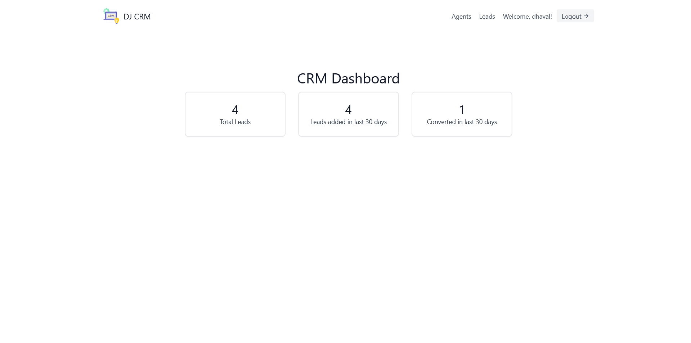
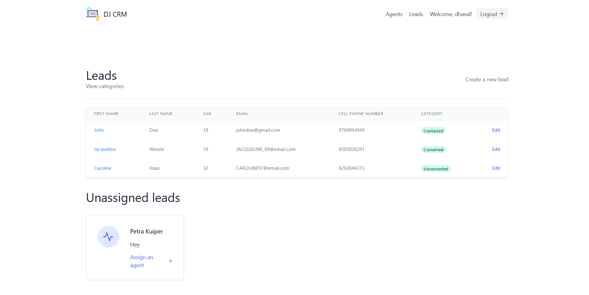
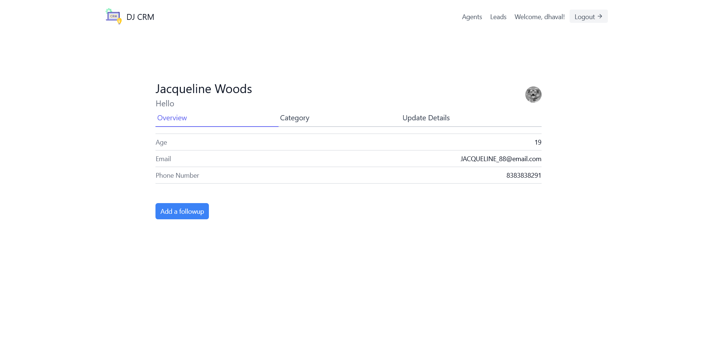
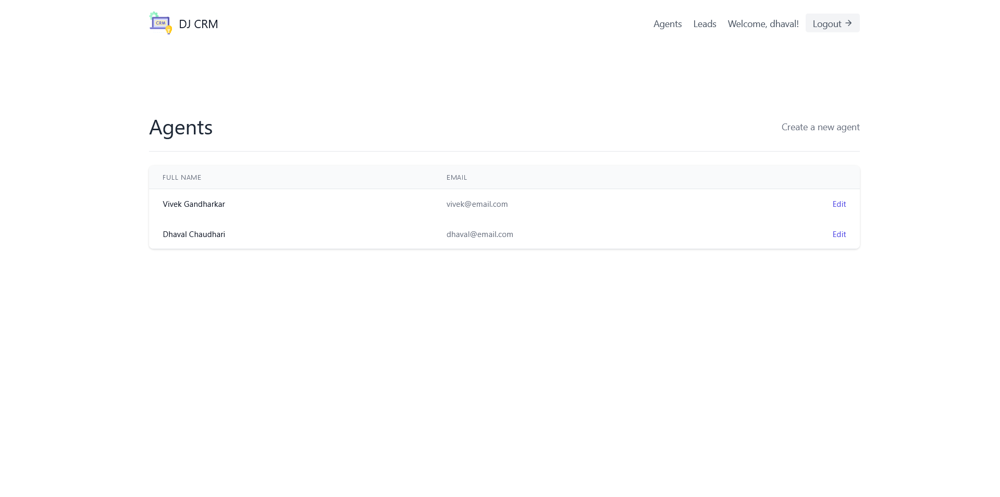

# CRM-System

This is Customer relationship management system which helps users to manage relationships and interactions with the customer and assign them to agents efficiently

## Technologies

- Python
- Django
- Django Rest Framework
- Tailwand CSS
- PostgreSQL

### Installation

1. Create a local copy of this git repository with `git clone` command.

   ```shell
   $ git clone https://github.com/dhavall13/CRM-System.git
   ```

2. Create a Virtual Enviornment with the `virtualenv` module.

   ```shell
   $ virtualenv .
   ```

3. Once you’ve created a virtual environment, you may activate it.

   ```shell
   $ source scripts/activate
   ```

4. Now, install the requirements from the `requirements.txt` file.

   ```shell
   $ pip install -r requirements.txt
   ```

5. Now, apply the migrations with the management command.

   ```shell
   $ python manage.py migrate
   ```

6. Finally, start the developement server with the management commnad.

   ```shell
   $ python manage.py runserver
   ```

## Screenshots

- Dashbord
  

- Leads
  

- Profile
  

- Agents
  

## Authors

- Dhaval Chaudhari - [dhavall13](https://github.com/dhavall13/)

## License

This project is licensed under the MIT License - see the [LICENSE](../main/LICENSE) file for details
